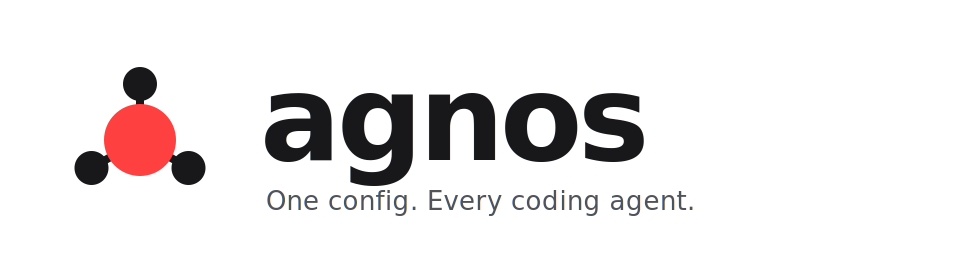

<p align="center">
  
</p>

<p align="center">
  <strong>One config. Every coding agent.</strong>
  <br/>
  <sub>Project-level configuration for AI coding agents, materialized into whatever each tool expects to find on disk.</sub>
</p>

<p align="center">
  <a href="https://www.npmjs.com/package/@luxia/agnos"></a>
  <a href="https://www.npmjs.com/package/@luxia/agnos"></a>
  <a href="https://nodejs.org"></a>
  <a href="https://github.com/rgdevme/luxia/blob/main/LICENSE"></a>
  <a href="https://github.com/rgdevme/luxia/actions/workflows/ci.yml"></a>
  
  
</p>

---

## What is agnos?

**agnos is a project-level configuration manager for AI coding agents.** You declare your rules, MCP servers, and skills once in a single `agnos.json` at the root of your repo. agnos materializes that declaration into whatever each agent expects: `CLAUDE.md` and `.mcp.json` for Claude Code, `AGENTS.md` and `.codex/config.toml` for Codex, and so on for every agent you add.

It is **agent-agnostic** by design. New agents are not patches to a hard-coded list. They are plugins, discovered from any package in `node_modules` that declares an `"agnos"` field in its `package.json`. The same is true for the categories of content agnos manages: rules, MCP servers, skills, and docs are all themselves plugins. Both axes grow without touching the core.

## Why we built it

The AI coding ecosystem fragmented faster than anyone could standardize. Every agent has its own file format, its own directory layout, its own opinion about where rules live and how MCP servers are configured. A team using Claude Code, Codex, and Cursor pays the cost three times: three copies of the same rules drifting apart, three MCP files to keep in sync, three places to onboard a new contributor.

We built agnos because we got tired of:

- **Maintaining the same rules in five different files.** One canonical `AGENTS.md`, materialized everywhere it needs to be.
- **Copy-pasting MCP server configs across `.mcp.json`, `.codex/config.toml`, and whatever the next tool invents.** Declare once; let each agent plugin translate.
- **Managing skill packs by hand.** Pull skills from any git repo by composite source ref. Lock them. Update them. Share them across agents through a single symlinked directory.
- **Being unable to add a new agent without forking a tool.** Drop a package with `"agnos": { "type": "agent", "id": "..." }` into `node_modules` and it just works.

agnos is intentionally not a runtime, not a proxy, not an agent of its own. It is a tiny CLI that owns one file (`agnos.json`) and a thin state cache (`.agnos/`), and it does exactly one thing well: turn declared configuration into materialized files for every agent you have enabled.

## Quick start

Install globally, run inside any project:

```sh
npm i -g @luxia/agnos
cd my-project
agnos init
```

`agnos init` walks you through two things: where your rules live (default `./AGENTS.md`) and which agents to enable. It writes `agnos.json`, materializes per-agent files, and never touches anything you did not declare.

A typical `agnos.json` looks like this:

```json
{
  "$schema": "https://unpkg.com/@luxia/core/schema.json",
  "agents": ["claude-code", "codex"],
  "rules": { "filename": "AGENTS.md", "root": ".", "dirs": [] },
  "skills": {
    "sources": {
      "pdf": "github:vercel-labs/agent-skills/skills/pdf",
      "review": "file:./skills/review"
    }
  },
  "mcp": [
    {
      "name": "github",
      "transport": "stdio",
      "command": "npx",
      "args": ["-y", "@modelcontextprotocol/server-github"],
      "env": { "GITHUB_TOKEN": "${GITHUB_TOKEN}" }
    }
  ]
}
```

Run `agnos install` and the right files appear: `CLAUDE.md` symlinks to `./AGENTS.md`, `.mcp.json` is regenerated, `.codex/config.toml` is regenerated, `.claude/skills/` and `.agents/skills/` both point at `.agnos/skills/` where the canonical content lives. Add an agent later? `agnos agent add <id>`. Remove one? `agnos agent remove <id>` cleans up after itself.

## Commands at a glance

| Command                        | What it does                                                |
| ------------------------------ | ----------------------------------------------------------- |
| `agnos init`                   | Set rules + pick agents. Idempotent.                        |
| `agnos rules [path]`           | Show config, or set/relocate the root rules file.           |
| `agnos rules add/remove <dir>` | Manage nested rule directories.                             |
| `agnos agents`                 | Pick which agent plugins are active.                        |
| `agnos agent add <id\|pkg>`    | Install and activate an agent plugin.                       |
| `agnos agent remove <id>`      | Deactivate and clean up an agent plugin's artifacts.        |
| `agnos skill add <source>`     | Pull skills from a git repo or local directory.             |
| `agnos skill update <name>`    | Re-fetch a skill at a new commit.                           |
| `agnos skill remove <name>`    | Remove a skill.                                             |
| `agnos mcp add <name>`         | Add an MCP server (interactive).                            |
| `agnos mcp remove <name>`      | Remove an MCP server.                                       |
| `agnos install`                | Re-materialize current declarations for every active agent. |

Run `agnos --help` for the full reference.

## How it works

agnos is built around two orthogonal plugin axes.

**Agent plugins** describe _how_ to materialize content for a specific tool. They declare what file the rules live in, what shape the MCP config should take, where skills should be linked. `@luxia/agent-claude-code` and `@luxia/agent-codex` ship with the umbrella package.

**Domain plugins** describe _what_ content agnos manages. Rules are one domain. MCP servers are another. Skills, docs, and any future category (prompts, personas, workflows) are domains too. `@luxia/domain-rules`, `@luxia/domain-mcp`, `@luxia/domain-skills`, and `@luxia/domain-docs` ship in the box.

When you run `agnos install`, the orchestrator walks the active agents and the registered domains and calls each agent's per-domain handlers with the resolved state. Every handler is idempotent. Every operation either succeeds or leaves the disk in the state it found it.

```
                       agnos.json (your single source of truth)
                                       |
                                       v
        +-------------------- core orchestrator ---------------------+
        |                              |                             |
        v                              v                             v
   domain-rules                    domain-mcp                   domain-skills
        |                              |                             |
        +------------------------------+-----------------------------+
                                       |
                                       v
                +----------------------+----------------------+
                |                                             |
                v                                             v
        agent-claude-code                                 agent-codex
        (writes CLAUDE.md,                               (writes AGENTS.md,
         .mcp.json,                                       .codex/config.toml,
         .claude/skills/ link)                            .agents/skills/ link)
```

## Build your own agent plugin

Any npm package with an `"agnos"` field in its `package.json` is discoverable. Here is a minimal example for a hypothetical agent that reads rules from `.myagent/rules.md` and MCP servers from `.myagent/servers.json`.

**`package.json`**

```json
{
  "name": "agnos-agent-myagent",
  "version": "0.1.0",
  "type": "module",
  "main": "./dist/index.js",
  "agnos": {
    "type": "agent",
    "id": "myagent"
  },
  "peerDependencies": {
    "@luxia/core": "^0.0.5"
  }
}
```

The `agnos` field is the entire registration. `type` is `"agent"` (or `"domain"`), `id` is the short name users type in `agnos.json#agents`. agnos walks `node_modules` at startup, finds your package, and loads its default export.

**`src/index.ts`**

```ts
import fs from "node:fs/promises";
import path from "node:path";
import type { AgentPlugin, MaterializeContext, ResolvedMcp, ResolvedRule } from "@luxia/core";

const RULES_FILE = path.join(".myagent", "rules.md");
const MCP_FILE = path.join(".myagent", "servers.json");

const myAgent: AgentPlugin = {
  id: "myagent",
  displayName: "My Agent",

  // Declarative: the skills domain links this directory to .agnos/skills/.
  // No per-skill handler needed.
  paths: {
    skillsDir: path.join(".myagent", "skills"),
  },

  handles: {
    rules: {
      async onInitialize(state, ctx) {
        if (state) await writeRules(state, ctx);
        else await removeRules(ctx);
      },
      async onCleanup(ctx) {
        await removeRules(ctx);
      },
    },
    mcp: {
      async onInitialize(state, ctx) {
        await writeMcp(state, ctx);
      },
      async onCleanup(ctx) {
        await removeMcp(ctx);
      },
    },
  },
};

async function writeRules(rule: ResolvedRule, ctx: MaterializeContext) {
  const target = path.join(ctx.projectRoot, RULES_FILE);
  await fs.mkdir(path.dirname(target), { recursive: true });
  await ctx.linker.link(rule.absolutePath, target, { fallback: "copy" });
  ctx.logger.info(`${RULES_FILE} -> ${rule.relativeSource}`);
}

async function removeRules(ctx: MaterializeContext) {
  await ctx.linker.unlink(path.join(ctx.projectRoot, RULES_FILE)).catch(() => {});
}

async function writeMcp(servers: ResolvedMcp[], ctx: MaterializeContext) {
  const out = { servers: servers.map((s) => ({ ...s })) };
  const file = path.join(ctx.projectRoot, MCP_FILE);
  await fs.mkdir(path.dirname(file), { recursive: true });
  await fs.writeFile(file, JSON.stringify(out, null, 2) + "\n", "utf8");
  ctx.logger.info(`${MCP_FILE} (${servers.length} servers)`);
}

async function removeMcp(ctx: MaterializeContext) {
  await fs
    .rm(path.join(ctx.projectRoot, path.dirname(MCP_FILE)), { recursive: true, force: true })
    .catch(() => {});
}

export default myAgent;
```

That is the whole plugin. Build it, publish it, and:

```sh
npm i -D agnos-agent-myagent
agnos agent add myagent
```

A few things worth knowing:

- **Idempotency is non-negotiable.** Every handler must be safe to re-run. The orchestrator re-materializes on every `agnos install`.
- **The `ctx.linker` is cross-platform.** It probes for symlink privileges, falls back to junctions on Windows, and can copy if the user opts in. Never call `fs.symlink` directly.
- **Handlers can be sparse.** Only implement the domains your agent cares about. The skills domain is fully declarative through `paths.skillsDir`. The rules and MCP domains fall back to `onInitialize` if you do not provide `onAdded`/`onRemoved`/etc.
- **`onCleanup` is what runs on `agnos agent remove`.** Strip everything you wrote. Cleanup is per-command; there is no manifest, so the agent itself is the source of truth about what it owns.
- **Add a new domain the same way.** Set `"agnos": { "type": "domain", "id": "prompts" }`, implement `DomainPlugin`, and any agent can write `handles: { prompts: { ... } }` to participate.

The full type contract lives in [`@luxia/core`](packages/core/README.md).

## Packages

This is a pnpm monorepo. Every package has its own README with usage details.

| Package                                                            | Purpose                                                       |
| ------------------------------------------------------------------ | ------------------------------------------------------------- |
| [`@luxia/agnos`](packages/agnos/README.md)                         | Umbrella install. Ships the CLI plus every default plugin.    |
| [`@luxia/core`](packages/core/README.md)                           | Plugin framework, types, orchestrator, CLI dispatcher.        |
| [`@luxia/agent-claude-code`](packages/agent-claude-code/README.md) | Strategy plugin for Claude Code.                              |
| [`@luxia/agent-codex`](packages/agent-codex/README.md)             | Strategy plugin for OpenAI Codex.                             |
| [`@luxia/domain-rules`](packages/domain-rules/README.md)           | Rules domain. Owns `agnos.json#rules`.                        |
| [`@luxia/domain-mcp`](packages/domain-mcp/README.md)               | MCP servers domain. Owns `agnos.json#mcp`.                    |
| [`@luxia/domain-skills`](packages/domain-skills/README.md)         | Skills domain. Owns `agnos.json#skills` and `.agnos/skills/`. |
| [`@luxia/domain-docs`](packages/domain-docs/README.md)             | Project documentation domain. Owns `agnos.json#docs`.         |

## Status

agnos is pre-1.0. The plugin API is stable enough to build against, and the default agents and domains are battle-tested against the maintainer's own repos. Expect minor breaking changes on the road to 1.0; we will call them out in the changelog.

## Contributing

This repo runs on `pnpm`, Node 24+, and ESM only. The full coding standards live in [AGENTS.md](AGENTS.md). The short version: TypeScript everywhere, no `any`, no default exports outside plugin entries, async/await throughout, idempotency for anything that touches the filesystem.

```sh
pnpm install
pnpm build
pnpm test
```

Issues and pull requests welcome at [github.com/rgdevme/luxia](https://github.com/rgdevme/luxia).

## License

MIT.
